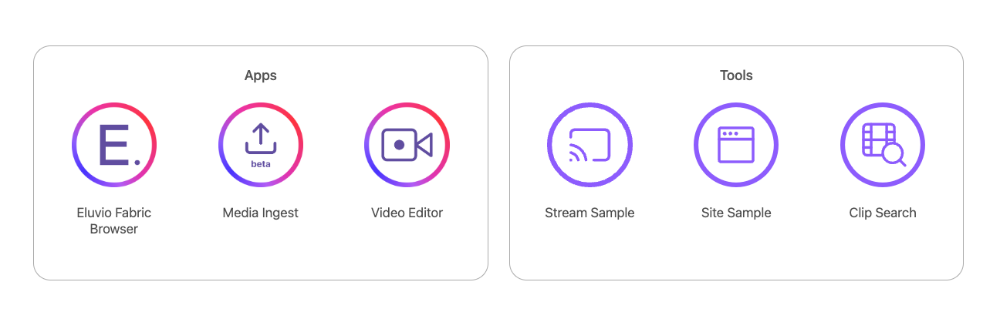

# Eluvio Automatic Clip Generation and Search-demo

## Developer mode

To host the application on your local machine, user need to install two applications.

### [**ElvCore**](https://github.com/eluv-io/elv-core-js)

ElvCore serves as a secure account management wrapper around other applications (e.g., the clip search). ElvCore contains users' account information (account address, private keys, etc.) and can perform fabric API requests and blockchain interactions on behalf of the contained app. This enables the app to perform actions without gaining access to the user's credentials. To get and install the repo, run

```
git clone git@github.com:eluv-io/elv-core-js.git
cd elv-core-js
cp configuration-example.js configuration.js
```

Open configuration.js, edit and save as

```js
const EluvioConfiguration = {
  "config-url": "https://main.net955305.contentfabric.io/config",
  network: "main",
  apps: {
    "Eluvio Fabric Browser": "https://browse.demov3.contentfabric.io",
    "Video Editor": "https://video-editor.demov3.contentfabric.io",
    "Site Sample": "https://site-sample.demov3.contentfabric.io",
    "Stream Sample": "https://display.demov3.contentfabric.io",
    "Media Ingest": "https://studio.demov3.contentfabric.io",
    "Clip Browser": "http://localhost:3000",
  },
};
```

Finish the setting up by running

```
  npm install
  npm run serve
```

### **Elv-Clip-Search**

Setting up and running `Elv-Clip-Search` with NPM

```
git clone git@github.com:eluv-io/elv-clip-search.git
cd elv-clip-search/
npm install
npm start
```

Then open http://localhost:8082 in your browser. You will get


## Deployed elv-clip-search

Access clip-search through [Fabric Apps](https://core.v3.contentfabric.io/#/apps) or use [URL shortcut](elv.lv/apps)

You will get



### Search Index Status

| Tenant | Search v1                          | Search v2                          | Notes                                         |
| ------ | ---------------------------------- | ---------------------------------- | --------------------------------------------- |
| MGM    | `iq__44VReNyWedZ1hAACRDBF6TdrBXAE` | `iq__2oENKiVcWj9PLnKjYupCw1wduUxj` | 260 full-length videos                        |
| MGM    | `iq__KeALttw1e5suBNYcdKHoEVEhfN8`  |                                    | 2 clips tagged w/ GIT                         |
| SONY   | `iq__2oTG3eei6xUFjkaaBpfx4Ry4wrJm` |                                    | 41 full-length videos                         |
| SONY   | `iq__2DTx9v7gYNFhYa2uNWEtT5qG2Jn3` |                                    | 10 full-length videos customized w/ SONY data |
| SONY   |                                    | `iq__4Dezn5i6EZs4vFCD4qE8Xc4QbXsf` | 187 full-length videos tagged w/ GIT          |

The rendered UI depends on the version of the search index,
**with v1 index, user will get**


- `Search phrase` has the following possible formats:

  - `Add Keywords` conducts an exact match and is madataory for v1 search index
  - `<keyword>` performs a global search regardless of the field name
  - `f_<searchable_field_name>:=<keyword>` restricts the search to the field `<searchable_field_name>`
  - multiple keywords are joined by default using `"AND"` by default, i.e., `f_celebrity:= "Daniel Craig" AND f_speech_to_text:= "shaken not stirred"`

- What are the searchable fields of my Index Object ?

  - Known `<QID>` of the Index Object, you can retrieve the searchable fields running this command:

    `curl -s 'https://<HOST>/qlibs/<LIB>/q/<QID>/meta/indexer/config/indexer/arguments/fields?authorization=<TOKEN>' | jq "keys"`

- See [Search API](https://github.com/eluv-io/elv-search/blob/master/SearchAPI.md) for more details

**with v2 index, user will get**


- the major difference between search v1 and search v2 lies in the 'Search phrase' feature, which enables typo tolerance, as opposed to exact match functionality in search v1
  - `search_fields` limits the fields that will be searched by the query; if not specified, search v2 makes a global search
- if users leave `Search Phrase` blank and input only `Add Keywords`, clip search performs almost identitcally to search v1

## Host on a remote server

If run on a remote server, and try to access on your local browser, open an SSH tunnel in background

```
ssh -NfL localhost:3000:localhost:3000  <user_name>@<ssh_address>
```

then open `localhost:3000` in the local browser.
