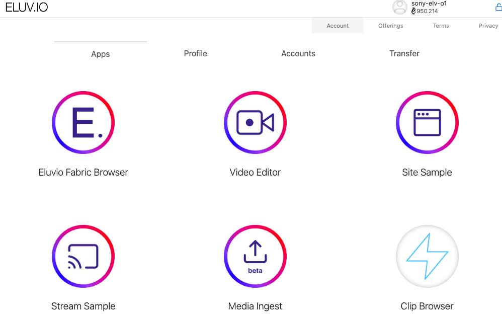

## Developer mode

### [**elv-core-js**](https://github.com/eluv-io/elv-core-js)

ElvCore serves as a secure account management wrapper around other applications (e.g., the clip search). ElvCore contains users' account information (account address, private keys, etc.) and can perform fabric API requests and blockchain interactions on behalf of the contained app. This enables the app to perform actions without gaining access to the user's credentials. To get and install the repo, run

```
git clone git@github.com:eluv-io/elv-core-js.git
cd elv-core-js
cp configuration-example.js configuration.js
```

Open configuration.js, edit and save as

```js
const EluvioConfiguration = {
  "config-url": "https://main.net955305.contentfabric.io/config",
  network: "main",
  apps: {
    "Eluvio Fabric Browser": "https://browse.demov3.contentfabric.io",
    "Video Editor": "https://video-editor.demov3.contentfabric.io",
    "Site Sample": "https://site-sample.demov3.contentfabric.io",
    "Stream Sample": "https://display.demov3.contentfabric.io",
    "Media Ingest": "https://studio.demov3.contentfabric.io",
    "Clip Browser": "http://localhost:3000",
  },
};
```

Finish the setting up by running

```
  npm install
  npm run serve
```

### **elv-clip-search**

Setting up and running `elv-clip-search` with NPM

```
git clone git@github.com:eluv-io/elv-clip-search.git
cd elv-clip-search/
npm install
npm start
```

Then open http://localhost:8082 in your browser. You will get



### Host on a remote server

If run on a remote server, and try to access on your local browser, open an SSH tunnel in background

```
ssh -NfL localhost:3000:localhost:3000  <user_name>@<ssh_address>
```

then open `localhost:3000` in the local browser.
